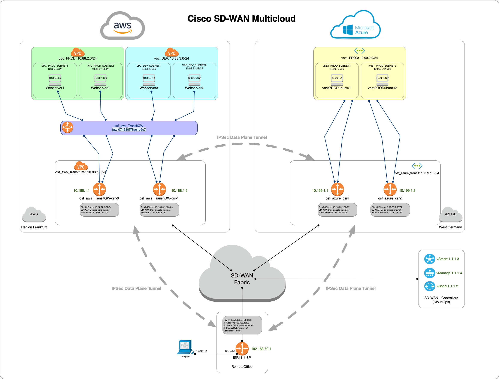

# **Creates AWS VPC with 3 subnet and 3 web-server**

## Table of Contents <!-- omit in toc -->

- [**AWS web server creation**]
  - [**1. Overview**](#1-Overview)
  - [**2. Installation**](#2-installation)

## **1. Overview**

* This script creates in eu-central-1 one (1) vpc with CIDR: 10.1.0.0/16
* Within this vpc it creates three subnets (10.1.[1-3].0/24)
* Internet Gateway (igw) will be created to get reachability to the internet
* Routing table will be formed
* Security groups will be created to allow external access: SSH and HTTP
* NGINX server will be installed with little bash script to create HTML file
* Output section will show FQDN of the all web-servers  

-----



-----

## **2. Installation**

* Step-1: ```terraform plan``` create execution plan as defined in code
* Step-2: ```terraform apply``` deploy AWS environment according to plan file
* Step-3: ```terraform destroy``` delete AWS environemt according to the state file
